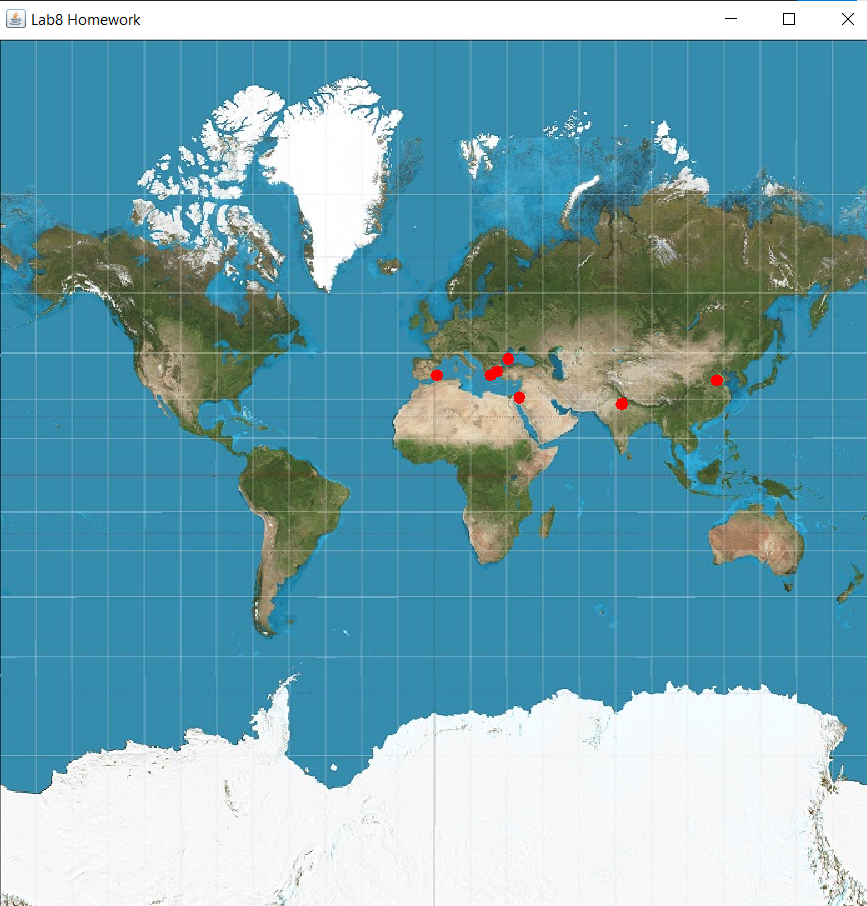

# Pavel Petronel 2A3

<ul>
<li> Create the necessary table in order to store <i>cities</i> in your database. A city may contain: id, country, name, capital(0/1), latitude, longitude
</li><li> Create an object-oriented model of the data managed by the application.
</li><li> Create a <i>tool</i> to import data from a real dataset: <a href="https://www.kaggle.com/datasets/nikitagrec/world-capitals-gps">World capitals gps</a> or other.
</li><li> Display the <a href="https://www.geeksforgeeks.org/program-distance-two-points-earth/">distances</a> between various cities in the world.
</li><li> (+1p) Create a 2D map (using Swing or JavaFX) and draw on it the cities at their corresponding <a href="https://www.baeldung.com/java-convert-latitude-longitude">locations</a>.
</li></ul>

- Am creat tabelele necesare direct din pgAdmin
- Am creat un model orientat obiect după tabelele din baza de date (câte o clasă pentru fiecare, continent, oraș, țară)
- Am importat orașele dintr-un fișier CSV, luând linie cu linie și dând split după virgulă.
- Am afișat distanțele dintre anumite orașe.
- Am creat o mapă 2D cu ajutorul proiectiei mercator.

